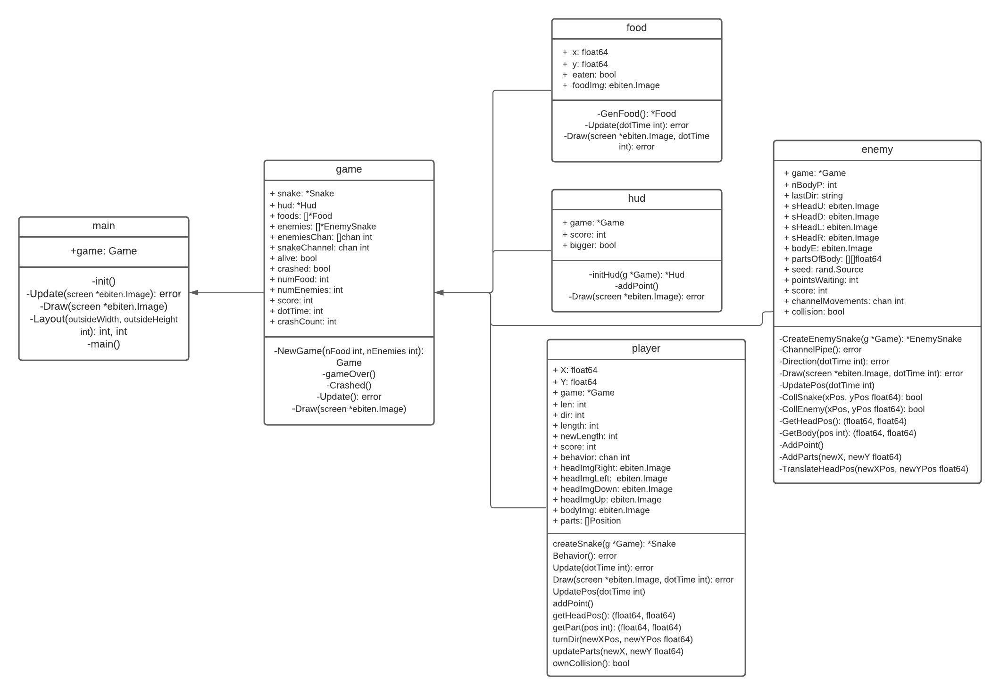

# Arquitecture

This document displays and explains the structure of the game.
The game is composed of 6 golang scripts, each managing an important part of the game.
* main.go:
  Takes care of initializing the game by gathering the required information, while also keeps updating the state of the game.
* game.go:
  Handles the game mechanics, such as Game Start, Game Over and the management of the game's entities (Player, Enemies, Food Items).
* hud.go:
  Creates and Updates the Game's HUD, which displays the player's Score and LifePoints.
* player.go:
  Creates and manages the player character, actions such as movement and snake growth are managed by it.
* enemy.go:
  Creates and manages the enemy characters, actions such as movement and snake growth are managed by it.
* food.go:
  Creates and manages the food items, it manages their generation and drawing.
  
# UML Chart

The following UML Chart displays the project structure and each of the scripts' components.

